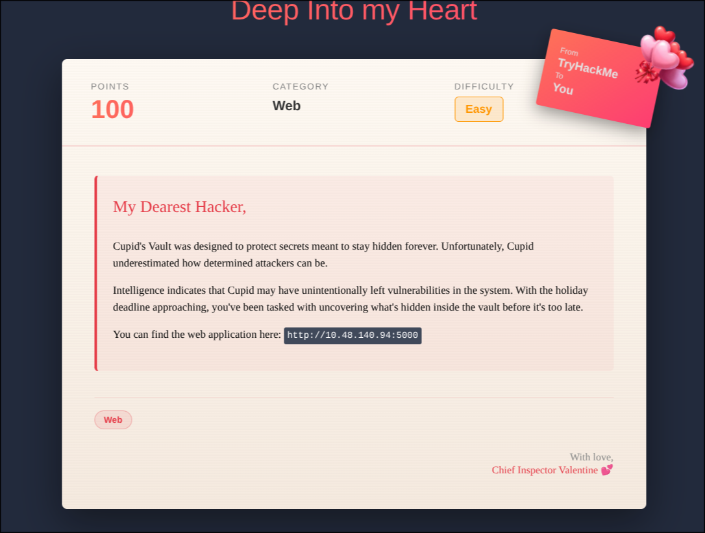
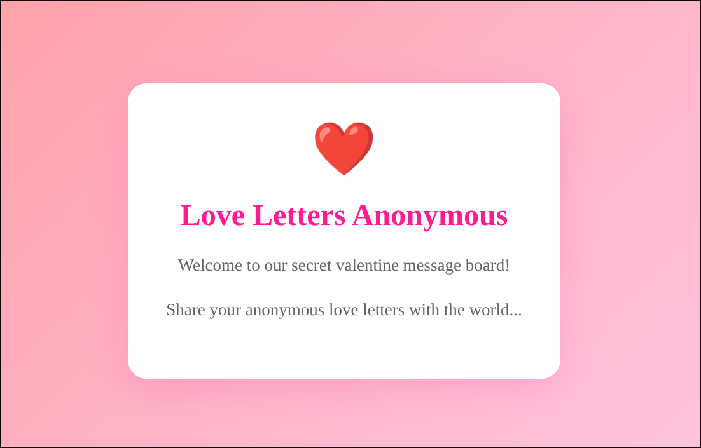
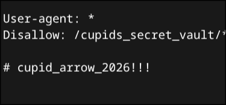

# Hidden Deep Into my Heart

Not much to go off of, so lets do some classic enumeration !

- Check robots.txt and sitemap.xml

- Run nmap and gobuster in the meantime

---

*we'll take note of this for now*

---

gobuster is still running but nmap is done, only thing worth mentioning is :

(Run Nmap with the default scripts if you don't get the same results)

oooh so we're making some progress !

---

Gobuster is still going for longer than it should so lets repoint it towards the new dir we found

what do we have here !

---

I've been trying to bruteforce this page for wayyyy too long than I should have, then I remembered the robots.txt from earlier! Use it as a password, with the username admin and you should get the flag !
