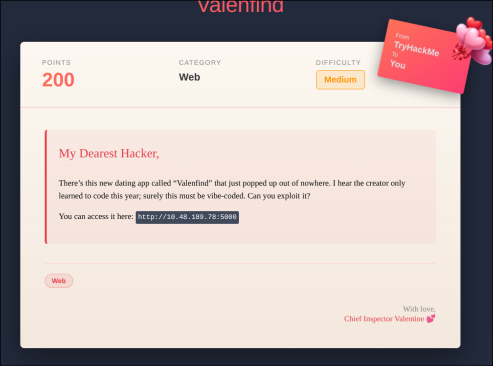
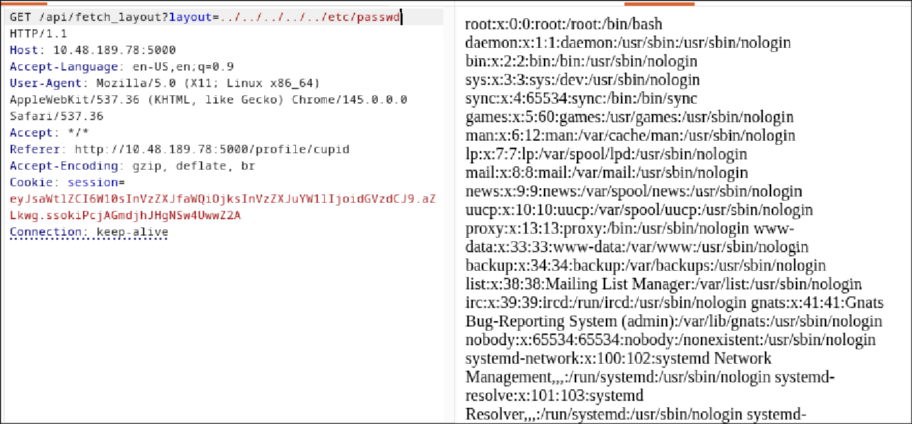
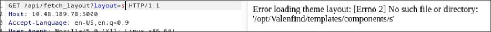
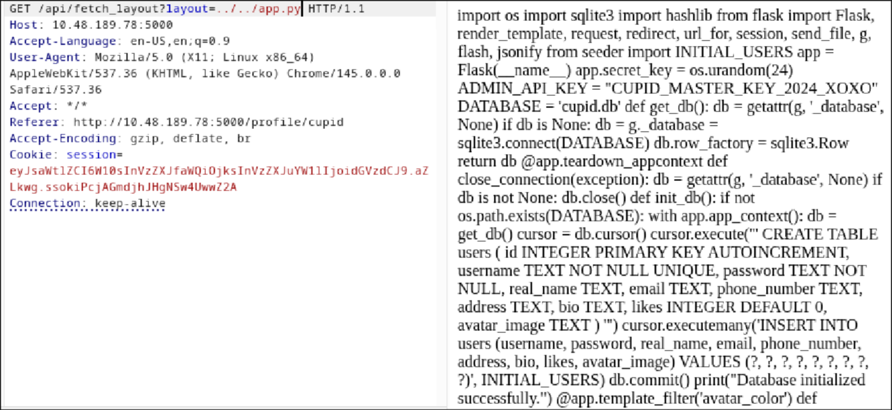

# Valenfind

I did everything with Burp on this one, just this once don't bother with anything else, just use its browser or a proxy

---




---

I poked around for a while and nothing stuck to me, except for this :


It just looked sooo.. out of place ?

so i looked at its source code and it looks really promising for [LFI](https://en.wikipedia.org/wiki/File_inclusion_vulnerability) :


Gave it a shot and here's the system's passwd !



---

### Finding the flag

First I used a Sniper attack to try and find the flag, i made a list of common flag locations, in home in root, but nothing, so i did the next best thing, let's get the app and dig into its source code !

by inserting a random input, we get an error message that shows us our path :



now we request the app :



---

### Getting the flag

The flag was not on the system as far as we could tell, so we downloaded the app to a file on our system to make it more readable, and soon discovered the Admin API token.

the system didn't have the flag as far as we could tell, so let's use the Admin token to request the database as it's our last promising lead.

```bash
curl -H "X-Valentine-Token: Token" http://<target>/api/admin/export_db --output Database.db
```

Open the database with sqlite and you'll find the flag there !.