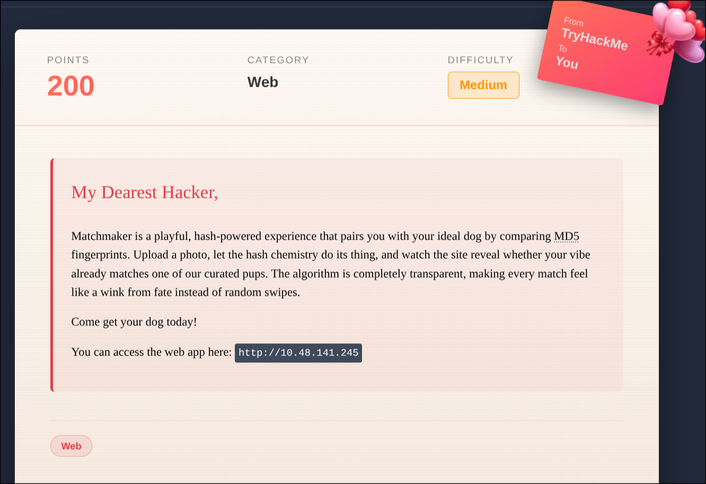
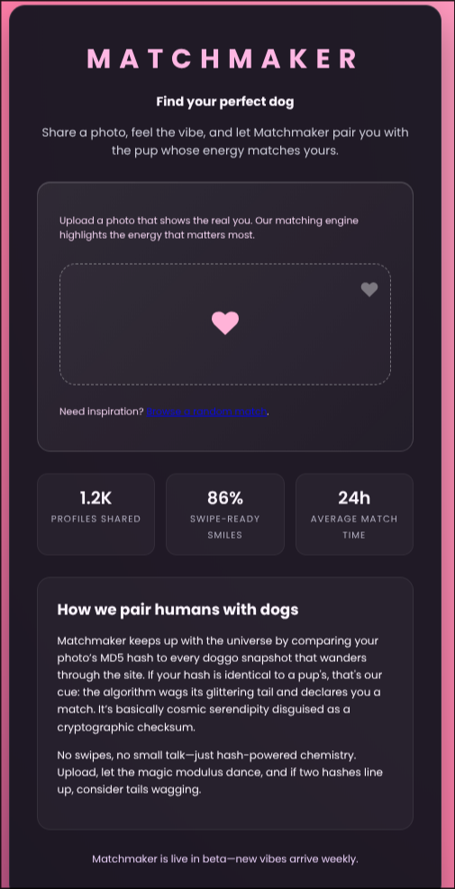

# When Hearts Collide



"Collide", "md5". so we need to do some kind of hash collidion, aaand md5 is already broken, so we need to do an md5 hash collidion (duh)

---

### some context

Hashes should be uniqe, but from time to time and with some week algorethams like md5 and sha1, they can make coliding hases, ie 2 compleatly difrent files, but still give off the same hash value



- The site here gives you a matching pup based on the md5 hash, so we need to upload an image that has the same md5 has as anothor one that the site already has

- we cant upload the same image twice

_So how do we do that ?_

---

### HashClash


After the [md5hash was broken](https://www.mscs.dal.ca/~selinger/md5collision/) A volnter project started called [HashClash](https://web.archive.org/web/20071016235617/http://boinc.banaan.org:80/hashclash/) Started, to docemnet such collidions or 'clashes', it moved to [Github](https://github.com/cr-marcstevens/hashclash) in 2017, and there we will find the tools we need to make 2 files with the same md5 hash

```bash
git clone https://github.com/cr-marcstevens/hashclash
cd hashclash
```

**Now we have to build it from source**

(make sure you have the build dependancys installed)

```bash
./install_boost.sh
./build.sh
```

*(you can add 'time' before any comand to see how long it took you)*

now we need to make a new dir with a TXT file of your choice

```bash
mkdir dogs
echo "your text" > file.txt
```

And now we can finaly let it do the math, the script we need is in /scripts, so without leaving the dir we just made :

```bash
../scripts/generic_ipc.sh file.txt
```

when its done upload both 'collision' files to the site and you sould get the flag !

but if for but if you dont have the hardwhere (or time(or pathince)), you can find the files i made in this repo